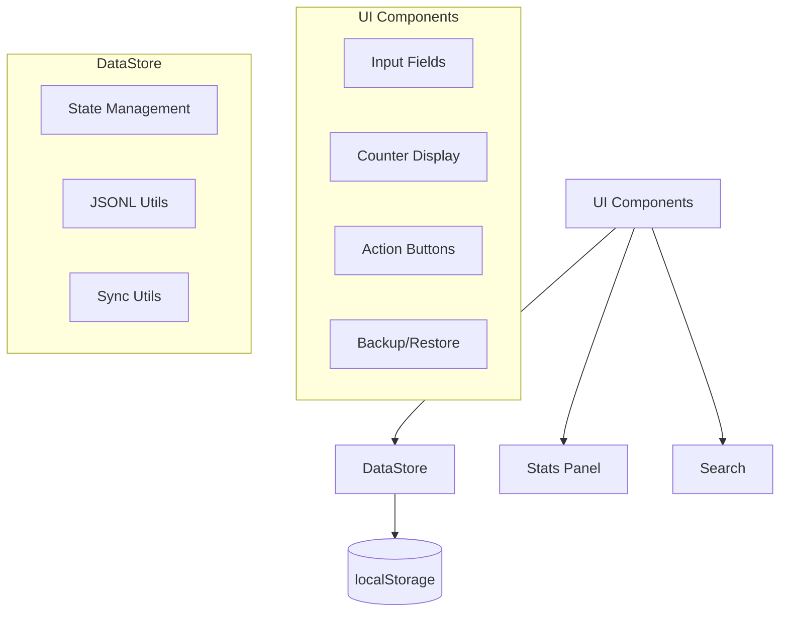
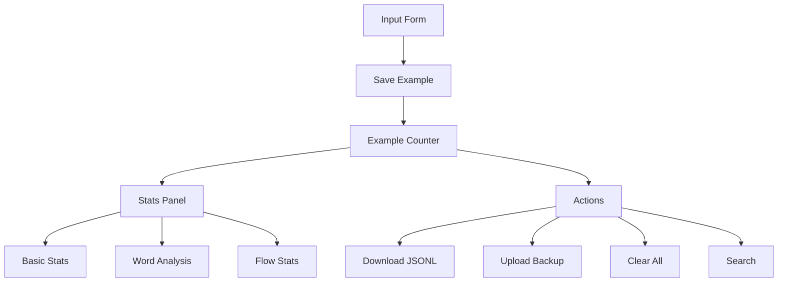
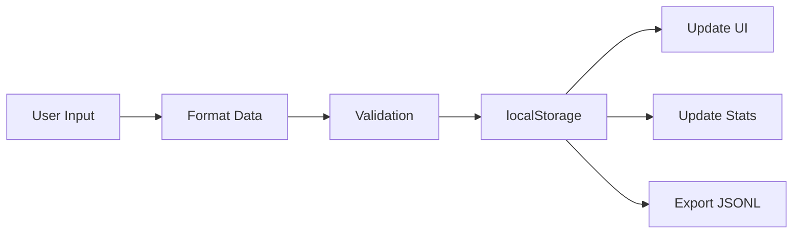

# System Patterns: Freya Dataset Builder

## Architecture Overview

## Implementation Patterns

### Single File Architecture
- All code in index.html
- Inline CSS and JavaScript
- No external dependencies
- GitHub Pages compatible

### Event-Driven Updates
- Dataset changes trigger UI updates
- Real-time search filtering
- Stats panel updates
- Counter synchronization

### Data Management
- localStorage persistence
- JSONL format for portability
- Backup/restore for sync
- Atomic operations

## Component Structure

### UI Components

### Data Flow

## Deployment Strategy

### GitHub Pages
- Main branch deployment
- No build process needed
- Instant updates
- Cross-device access

### Cross-Device Sync
- Download JSONL backup
- Upload to other devices
- Merge datasets
- Maintain consistency

## Error Handling
- Input validation
- Format verification
- Storage limits
- Export reliability
- Upload validation

## State Management
- localStorage as source of truth
- Real-time UI updates
- Search state management
- Stats panel state

## Mobile Support
- Responsive design
- Touch-friendly controls
- Efficient data handling
- Cross-device sync
